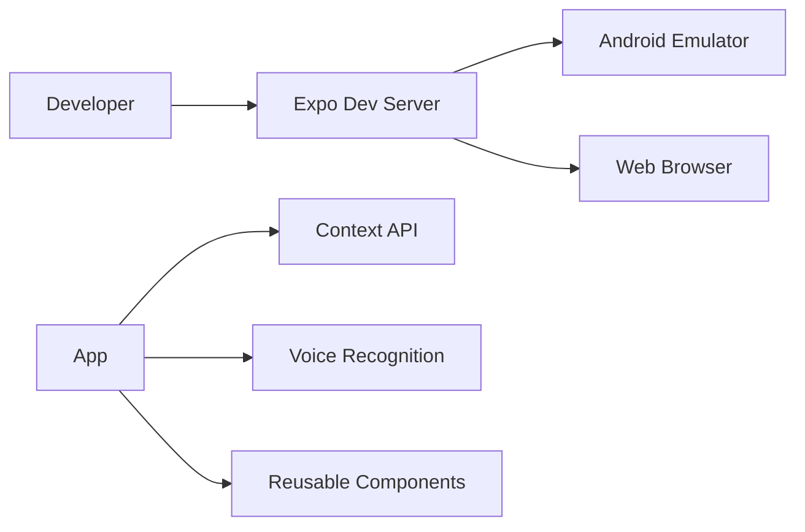

# 🎙️ Mobile_APP — Voice Enabled React Native Application

A modern **cross-platform mobile application** built using **React Native + Expo**, featuring voice recognition, modular architecture, tab-based navigation, and scalable frontend patterns.

This project demonstrates practical mobile development workflows including emulator setup, reusable component architecture, state management using Context API, and native mobile integrations.


---

# 📱 Overview

This application is designed as a scalable mobile foundation using Expo Router and React Native best practices. It integrates voice-enabled features while maintaining clean architecture and reusable UI systems.

---

# ✨ Features

| Feature | Description |
|----------|-------------|
| 🎤 Voice Recognition | Speech-to-text interaction support |
| 🧭 Expo Router Navigation | File-based routing system |
| 📱 Cross-platform Support | Android + Web support |
| 🔔 Notification Management | Context-based global notification system |
| ⚡ Real-time State Updates | Managed using React Context API |
| 🧩 Modular Components | Reusable and scalable architecture |
| 🪝 Custom Hooks | Encapsulated reusable business logic |
| ⚙️ Emulator Ready | Android Studio emulator integration |
| 🚀 Fast Refresh | Instant Expo development updates |

---

# 🏗️ Architecture

```bash
Mobile_APP/
├── app/                # Expo Router screens & routes
├── components/         # Shared reusable components
├── context/            # Global state management
├── hooks/              # Custom React hooks
├── constants/          # App constants & configs
├── assets/             # Images, icons, fonts
├── services/           # Voice & utility services
├── utils/              # Helper functions
├── package.json
└── README.md
```

---

# ⚡ Tech Stack

## Frontend
- React Native
- Expo SDK
- Expo Router
- JavaScript / TypeScript
- React Context API

## Development Tools
- Android Studio Emulator
- Node.js
- npm
- Expo CLI

---

# 🧠 Core Concepts Demonstrated

- Cross-platform mobile development
- Voice recognition integration
- Context API state management
- File-based routing with Expo Router
- Reusable component architecture
- Mobile-first UI structure
- Emulator debugging workflow
- Scalable folder organization

---

# 🚀 Quick Start

## Prerequisites

Make sure you have installed:

- Node.js 18+
- npm
- Expo CLI
- Android Studio
- Android Emulator / Physical Device

---

# 📦 Installation

## 1. Clone Repository

```bash
git clone https://github.com/Pranchal003/Mobile_APP.git
cd Mobile_APP
```

## 2. Install Dependencies

```bash
npm install
```

## 3. Start Expo Development Server

```bash
npx expo start
```

---

# 📱 Running the App

## Android Emulator

1. Open Android Studio
2. Start your Android Virtual Device (AVD)
3. Run:

```bash
npx expo run:android
```

OR press:

```bash
a
```

inside the Expo terminal.

---

## Web Version

```bash
npm run web
```

---

# 📂 Project Structure

| Folder | Purpose |
|--------|---------|
| `app/` | Screens & routing |
| `components/` | Shared UI components |
| `context/` | Global state management |
| `hooks/` | Reusable React hooks |
| `constants/` | App constants/configuration |
| `assets/` | Static assets |
| `services/` | Voice & helper services |
| `utils/` | Utility/helper functions |

---

# 🔧 Scripts

| Command | Description |
|---------|-------------|
| `npm start` | Start Expo server |
| `npm run android` | Run Android build |
| `npm run web` | Start web build |
| `npm run lint` | Run lint checks |
| `npm run reset-project` | Reset Expo project |

---

# 🎤 Voice Recognition System

The application includes voice-enabled interaction features such as:

- Speech-to-text input
- Real-time microphone access
- Voice command workflows
- Mobile voice interaction patterns

---

# 🧪 Development Workflow



---

# 📈 Future Improvements

- 🔐 User authentication
- ☁️ Backend API integration
- 📡 Real-time synchronization
- 🌙 Dark mode support
- 🔔 Push notifications
- 🧠 AI voice assistant features
- 📊 Analytics dashboard
- 💾 Cloud data persistence

---

# 💼 Portfolio Highlight

> A scalable React Native mobile application showcasing voice recognition, Expo Router navigation, reusable architecture, and Context API state management.

### GitHub Topics

```txt
react-native
expo
expo-router
mobile-app
voice-recognition
typescript
context-api
cross-platform
```

---

# 🌐 Repository

GitHub Repo:  
https://github.com/Pranchal003/Mobile_APP

---

# 📄 License

MIT License

---

# 👨‍💻 Author

Built with React Native & Expo for learning, experimentation, and production-style mobile application development.
